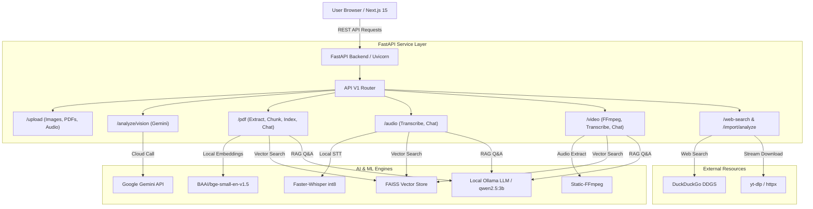
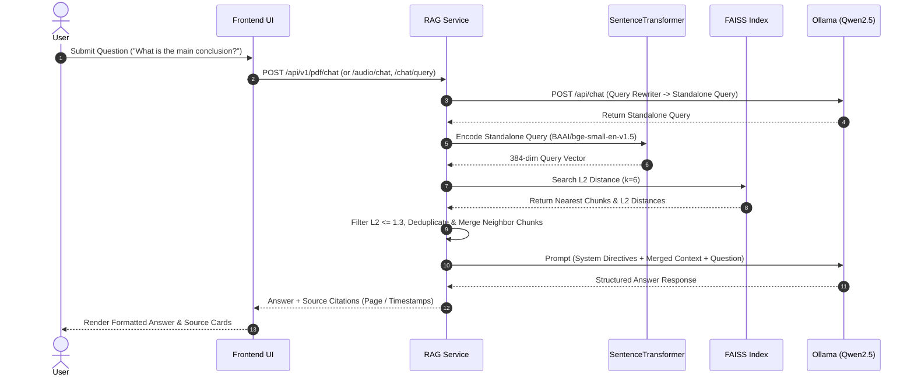

# 👁️ VisionGPT — Multimodal AI & Local RAG Workspace

[](https://opensource.org/licenses/MIT)
[](https://fastapi.tiangolo.com)
[](https://nextjs.org)
[](https://faiss.ai)
[](https://ollama.ai)
[](https://github.com/SYSTRAN/faster-whisper)

**VisionGPT** is a state-of-the-art, open-source multimodal workspace and local Retrieval-Augmented Generation (RAG) platform. It seamlessly unifies **Image Analysis**, **PDF Intelligence**, **Audio Transcription**, **Video Scene Analysis**, and **Web Search & Import** into a single, high-performance interface.

Built with **Next.js 15**, **FastAPI**, **Google Gemini Pro Vision**, **Faster-Whisper**, **FAISS Vector Search**, **BAAI/bge-small-en-v1.5 Embeddings**, and local **Ollama LLMs**, VisionGPT allows users to ingest, index, and interactively chat with documents, media files, and web content with complete privacy and low latency.

---

## 🚦 Project Status

VisionGPT is under active engineering and continuously evolving with new AI features.

| Status Category | Modules / Features |
| :--- | :--- |
| **🟢 Stable (Completed)** | • **Multimodal Vision Reasoning** (Google Gemini API)<br>• **PDF Intelligent RAG** (PyMuPDF + BGE Embeddings + FAISS + Ollama)<br>• **Audio Speech-to-Text & RAG** (Faster-Whisper INT8 + Chunking + FAISS)<br>• **Video Intelligence & RAG** (FFmpeg Audio Extraction + Whisper STT + FAISS)<br>• **Web Search & Direct Import** (DuckDuckGo + YouTube Video Filtering + PDF Auto-indexing)<br>• **Contextual Query Rewriting** (Pronoun resolution & Standalone query synthesis) |
| **🟡 In Progress** | • Cross-Document Knowledge Graph Merging<br>• Visual Bounding-Box & Object Grounding Overlay |
| **🔵 Planned Roadmap** | • PostgreSQL Session State & Chat History Persistence<br>• GPU Acceleration Auto-Scaling Worker Queues |

---

## ✨ Key Features

### 🖼️ Multimodal Vision Reasoning
- **Image Intelligence**: Upload screenshots, diagrams, photos, or documents (`.png`, `.jpg`, `.jpeg`, `.webp`).
- **Gemini Vision Engine**: Performs OCR, structural analysis, object detection, and visual QA using Google Gemini Pro Vision.

### 📄 PDF Document Processing & RAG
- **PDF Extraction**: Text parsing with page-level tracking powered by PyMuPDF (`fitz`).
- **Intelligent Chunking**: Preserves natural sentence and paragraph boundaries (120–180 words/chunk).
- **Local FAISS Indexing**: Builds an L2-distance FAISS vector store per document using `BAAI/bge-small-en-v1.5` embeddings.
- **RAG Conversational Chat**: Query documents using local LLMs (`qwen2.5:3b` via Ollama) with page-level citations.

### 🎙️ Audio Transcription & RAG
- **Speech-to-Text (STT)**: High-speed local transcription using `faster-whisper` (`small` model with `int8` quantization).
- **Temporal Segment Tracking**: Extracts start and end timestamps for every sentence segment.
- **Transcript RAG Chat**: Ingests audio files (`.mp3`, `.wav`, `.m4a`, `.ogg`) and provides Q&A with timestamped references.

### 🎥 Video Intelligence Pipeline
- **Audio Track Extraction**: Extracts 16kHz mono audio tracks from video containers (`.mp4`, `.mov`, `.avi`, `.mkv`, `.webm`) via `static-ffmpeg`.
- **Automated Video Indexing**: Transcribes video audio tracks and indexes segments into local FAISS vector stores for RAG querying.

### 🌐 Search From Web & Resource Import
- **DuckDuckGo Integration**: Live web search filtered by content type (`pdf` filetype or `youtube` video search).
- **YouTube Link Validation**: `is_importable_youtube_video_url` validator ensures returned YouTube results are direct, importable watch URLs (`youtube.com/watch?v=` or `youtu.be/`), rejecting channel pages, playlists, shorts, user profiles, handles, and browse feeds.
- **Direct Resource Import**: Automatically downloads PDFs or YouTube audio streams (`yt-dlp`), transcribes, chunks, and indexes them into the RAG knowledge base.

---

## 🏗️ System Architecture

VisionGPT employs a modern decoupled architecture separating the Next.js presentation layer from the asynchronous FastAPI backend processing engine.



### 🧠 Local RAG Retrieval Pipeline



---

## 🛠️ Tech Stack

| Domain | Technologies |
| :--- | :--- |
| **Frontend** | Next.js 15.2, React 19, TypeScript, TailwindCSS 4, Framer Motion, Lucide React |
| **Backend API** | Python 3.10+, FastAPI 0.110+, Uvicorn, Pydantic v2, Pydantic-Settings |
| **Document Processing** | PyMuPDF (`fitz`), Python-Multipart, HTTPX |
| **Audio & Video Processing** | `faster-whisper` (int8 quantization), `static-ffmpeg` |
| **AI / Machine Learning** | Google Gemini API (`google-generativeai`), `sentence-transformers` (`BAAI/bge-small-en-v1.5`), `faiss-cpu` (v1.8+), Ollama (`qwen2.5:3b`) |
| **Web Search & Scraping** | DuckDuckGo Search (`ddgs`), `yt-dlp` |
| **Database & Containerization** | PostgreSQL 16 (Alpine), SQLAlchemy 2.0 (Asyncpg ready), Docker, Docker Compose |

---

## 📁 Repository Structure

```
VisionGPT/
├── .env.example                # Template for environment variables
├── docker-compose.yml          # Multi-container orchestration (DB, Backend, Frontend)
├── README.md                   # Project documentation
├── backend/
│   ├── Dockerfile              # Backend container build specification
│   ├── requirements.txt        # Python dependency manifest
│   └── app/
│       ├── main.py             # FastAPI initialization, CORS, upload static mounts
│       ├── api/
│       │   └── v1/
│       │       ├── api.py      # Main V1 API router registration
│       │       └── endpoints/  # Feature endpoints
│       │           ├── analysis.py       # Gemini Vision reasoning
│       │           ├── audio.py          # Whisper transcription & audio RAG
│       │           ├── chat.py           # Unified vector store RAG query
│       │           ├── dev.py            # Diagnostic endpoints
│       │           ├── health.py         # Health check endpoint
│       │           ├── import_analyze.py # Resource import & auto-indexing
│       │           ├── pdf.py            # PDF text extraction, chunking, indexing & RAG
│       │           ├── upload.py         # File upload handlers (Image, PDF, Audio)
│       │           ├── video.py          # Video audio extraction & RAG
│       │           └── web_search.py     # DDGS search endpoint
│       ├── core/
│       │   ├── config.py       # Pydantic Settings & env configuration
│       │   └── rag.py          # Query rewriter, embeddings, FAISS search, chunk merger
│       ├── schemas/            # Pydantic request/response data contracts
│       └── services/           # Core business logic services
│           ├── import_service.py       # PDF & YouTube resource importer
│           ├── retriever_service.py    # Local FAISS index loader & search
│           ├── speech_service.py       # Faster-Whisper transcription singleton
│           └── web_search_service.py   # DDGS search & YouTube URL validation
├── frontend/
│   ├── Dockerfile              # Frontend Next.js container specification
│   ├── package.json            # Node.js dependencies and scripts
│   └── src/
│       ├── app/
│       │   ├── layout.tsx      # Root layout wrapper
│       │   ├── page.tsx        # Landing page with feature showcases
│       │   └── workspace/
│       │       └── page.tsx    # Interactive VisionGPT Workspace dashboard
│       ├── components/
│       │   └── SaaSLayout.tsx  # Workspace navigation layout
│       └── services/           # Frontend API client utilities (importApi, chatApi)
└── uploads/                    # Local storage for uploads and FAISS vector indices
```

---

## ⚡ Quick Start & Installation

### Prerequisites
- **Python**: `v3.10` or higher
- **Node.js**: `v18.0` or higher (`npm` v9+)
- **FFmpeg**: Required for audio/video processing (automatically handled via `static-ffmpeg` package, or system install)
- **Ollama**: Installed locally from [ollama.ai](https://ollama.ai)

---

### Step 1: Clone the Repository
```bash
git clone https://github.com/khizerfarhaan7/VisionGPT.git
cd VisionGPT
```

---

### Step 2: Configure Environment Variables
Copy `.env.example` to `.env` in the root directory:
```bash
cp .env.example .env
```
Edit `.env` and supply your **Google Gemini API Key**:
```env
GEMINI_API_KEY=your_actual_gemini_api_key_here
```

---

### Step 3: Select AI Resource Profile

VisionGPT supports environment-driven model profiles so you can switch between 4GB RAM local mode and High-Quality GPU server deployment mode seamlessly:

| Setting | `VISIONGPT_PROFILE=local` (Default) | `VISIONGPT_PROFILE=high_quality` |
|---|---|---|
| **Target Hardware** | Consumer Laptops (4 GB RAM Limit) | GPU Workstations / Dedicated Cloud Servers |
| **Local LLM** | `qwen2.5:3b` | `qwen2.5:14b` |
| **Embeddings** | `BAAI/bge-small-en-v1.5` (384d) | `BAAI/bge-large-en-v1.5` (1024d) |
| **Whisper STT** | `small` (int8, CPU) | `large-v3` (float16, CUDA) |
| **Florence-2 Vision** | `microsoft/Florence-2-base` (CPU) | `microsoft/Florence-2-large` (CUDA) |
| **Video Sampling** | 3.0s interval / 15.0s window | 1.0s interval / 5.0s window |
| **Gemini Model** | `gemini-2.5-flash` | `gemini-2.5-pro` |

*To enable High-Quality GPU mode in production:*
```env
VISIONGPT_PROFILE=high_quality
```

---

### Step 4: Local Model Preparation (Ollama)
Ensure Ollama is running, then pull the model matching your active profile:
```bash
# For local profile (Default)
ollama pull qwen2.5:3b

# For high_quality profile
# ollama pull qwen2.5:14b
```

---

### Step 4: Backend Setup
```bash
# Navigate to backend directory
cd backend

# Create virtual environment
python -m venv .venv

# Activate virtual environment (Windows PowerShell)
.venv\Scripts\activate
# Activate virtual environment (Linux/macOS)
# source .venv/bin/activate

# Install dependencies
pip install -r requirements.txt

# Run FastAPI development server
uvicorn app.main:app --host 0.0.0.0 --port 8000 --reload
```
*Backend API will be accessible at: `http://localhost:8000` (Swagger docs at `http://localhost:8000/docs`)*

---

### Step 5: Frontend Setup
In a new terminal window:
```bash
# Navigate to frontend directory
cd frontend

# Install Node modules
npm install

# Start Next.js development server
npm run dev
```
*Frontend Application will be accessible at: `http://localhost:3000`*

---

### 🐳 Docker Setup (Alternative Deployment)
You can launch the complete stack (PostgreSQL, FastAPI, Next.js) using Docker Compose:
```bash
docker-compose up --build -d
```

---

## ⚙️ Environment Variables Reference

| Variable | Description | Default | Required |
| :--- | :--- | :--- | :---: |
| `PROJECT_NAME` | Project title metadata | `VisionGPT` | Yes |
| `ENVIRONMENT` | Running environment (`development` / `production`) | `development` | Yes |
| `BACKEND_PORT` | Port for FastAPI service | `8000` | Yes |
| `FRONTEND_PORT` | Port for Next.js web UI | `3000` | Yes |
| `BACKEND_CORS_ORIGINS` | Allowed CORS origins (comma-separated) | `http://localhost:3000` | Yes |
| `UPLOAD_DIR` | Directory path for stored assets & vector indexes | `uploads` | Yes |
| `GEMINI_API_KEY` | Google Gemini Pro Vision API Key | `None` | **Yes (for Vision AI)** |
| `OLLAMA_BASE_URL` | Local Ollama LLM endpoint | `http://localhost:11434` | **Yes (for Local RAG)** |
| `OLLAMA_MODEL` | Local LLM model identifier | `qwen2.5:3b` | Yes |
| `POSTGRES_USER` | PostgreSQL user credentials | `postgres` | Optional |
| `POSTGRES_PASSWORD` | PostgreSQL password credentials | `postgres` | Optional |
| `POSTGRES_DB` | PostgreSQL database name | `visiongpt` | Optional |
| `POSTGRES_SERVER` | PostgreSQL server hostname | `localhost` | Optional |

---

## 🛰️ API Reference

### Health Check
- `GET /api/v1/health`
  - **Purpose**: Verify backend service status.
  - **Response**: `{"status": "healthy", "project": "VisionGPT"}`

---

### File Upload Endpoint
- `POST /api/v1/upload/image`
  - **Purpose**: Upload images for Gemini Vision analysis.
  - **Payload**: `multipart/form-data` with `file`.
- `POST /api/v1/upload/pdf`
  - **Purpose**: Upload PDF documents; returns PyMuPDF page count.
  - **Payload**: `multipart/form-data` with `file`.
- `POST /api/v1/upload/audio`
  - **Purpose**: Upload audio/video files for transcription.
  - **Payload**: `multipart/form-data` with `file`.

---

### Multimodal Vision Reasoning
- `POST /api/v1/analyze/vision`
  - **Purpose**: Perform visual reasoning over an uploaded image.
  - **Payload**: `{"image_path": "uploads/images/sample.jpg", "prompt": "Describe this layout"}`
  - **Response**: `{"success": true, "analysis": "..."}`

---

### PDF RAG Pipeline
- `POST /api/v1/pdf/extract`
  - **Purpose**: Extract text from specific PDF pages.
- `POST /api/v1/pdf/chunk`
  - **Purpose**: Slice extracted text into structured RAG chunks.
- `POST /api/v1/pdf/index`
  - **Purpose**: Compute embeddings and save a FAISS L2 index.
  - **Payload**: `{"filename": "document.pdf", "chunks": [...]}`
- `POST /api/v1/pdf/chat`
  - **Purpose**: RAG chat Q&A over an indexed PDF document.
  - **Payload**: `{"filename": "document.pdf", "question": "...", "history": []}`

---

### Audio & Video RAG Pipeline
- `POST /api/v1/audio/transcribe`
  - **Purpose**: Transcribe audio using `faster-whisper` and build FAISS index.
- `POST /api/v1/audio/chat`
  - **Purpose**: Q&A over audio transcription vector stores.
- `POST /api/v1/video/extract-audio`
  - **Purpose**: Extract WAV audio track from video files using static-ffmpeg.
- `POST /api/v1/video/analyze`
  - **Purpose**: Full video processing (Audio extraction -> STT -> FAISS indexing).
- `POST /api/v1/video/chat`
  - **Purpose**: Q&A over video transcription vector stores.

---

### Web Search & Import
- `POST /api/v1/web-search`
  - **Purpose**: Search DuckDuckGo filtered by `pdf` or `youtube`.
  - **Payload**: `{"query": "machine learning", "content_type": "pdf"}`
- `POST /api/v1/import/analyze`
  - **Purpose**: Download and auto-index web resources (PDF URLs or YouTube watch URLs).
  - **Payload**: `{"url": "https://www.youtube.com/watch?v=...", "content_type": "youtube"}`

---

## 🖼️ Application Interface (Screenshots)

*Insert actual application screenshots below:*

| Workspace Search & Import | PDF RAG Conversational Chat |
| :---: | :---: |
|  |  |
| *Search YouTube videos and PDF documents with instant import & FAISS indexing.* | *Interactive document Q&A powered by local FAISS vector search and Ollama.* |

| Audio Transcription & RAG | Multimodal Vision Reasoning |
| :---: | :---: |
|  |  |
| *Automated speech-to-text with segment timing and RAG transcript Q&A.* | *Visual OCR, structure extraction, and scene understanding via Gemini Vision.* |

---

## 🛡️ Error Handling & Troubleshooting

| Symptom / Error | Cause | Resolution |
| :--- | :--- | :--- |
| `HTTP 503 Service Unavailable` on Chat | Ollama is not running locally | Start Ollama via `ollama serve` and verify model: `ollama pull qwen2.5:3b`. |
| `HTTP 400 Bad Request` on YouTube Import | Invalid URL (channel, playlist, or short) | Ensure URL is a direct video watch link: `youtube.com/watch?v=...` or `youtu.be/...`. |
| `RuntimeError: Failed to load speech recognition model` | CPU/CUDA Whisper initialization issue | Verify `faster-whisper` and `static-ffmpeg` dependencies. System falls back automatically to `int8` CPU mode. |
| `HTTP 400 Bad Request: GEMINI_API_KEY not configured` | Missing API Key in `.env` | Add `GEMINI_API_KEY=your_key` to `.env` file and restart FastAPI backend server. |

---

## 🚀 Future Roadmap

- [ ] **Multi-Vector Store Fusion**: Search across multiple imported documents in a single unified query.
- [ ] **Cross-Language Translation**: Automated translation of transcribed audio into 50+ languages.
- [ ] **Persistent PostgreSQL Vector Cache**: Optional pgvector extension integration for centralized cloud vector search.
- [ ] **Streaming LLM Responses**: Server-Sent Events (SSE) for token-by-token streaming UI responses.

---

## 🤝 Contributing

Contributions are welcome! Follow these steps to contribute:
1. **Fork the Repository**
2. **Create a Feature Branch** (`git checkout -b feature/amazing-feature`)
3. **Commit Your Changes** (`git commit -m 'Add amazing feature'`)
4. **Push to the Branch** (`git push origin feature/amazing-feature`)
5. **Open a Pull Request**

---

## 📜 License

Distributed under the **MIT License**. See `LICENSE` for more information.

---

## 🙏 Acknowledgements

- [FastAPI](https://fastapi.tiangolo.com/) & [Pydantic](https://docs.pydantic.dev/)
- [Next.js](https://nextjs.org/) & [TailwindCSS](https://tailwindcss.com/)
- [FAISS](https://github.com/facebookresearch/faiss) by Meta AI Research
- [SentenceTransformers](https://www.sbert.net/) (`BAAI/bge-small-en-v1.5`)
- [Faster-Whisper](https://github.com/SYSTRAN/faster-whisper)
- [Ollama](https://ollama.ai/)
- [Google Gemini AI API](https://ai.google.dev/)
